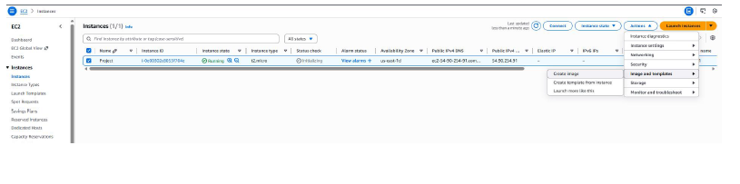
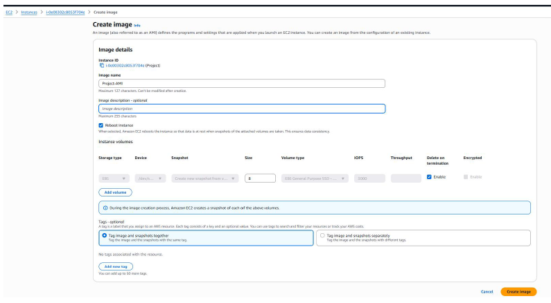
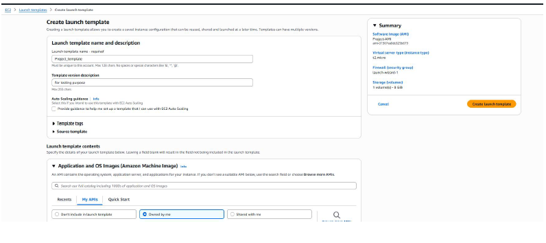
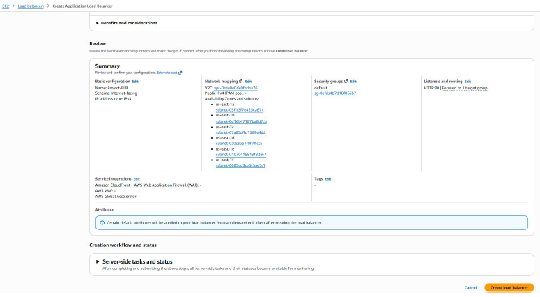
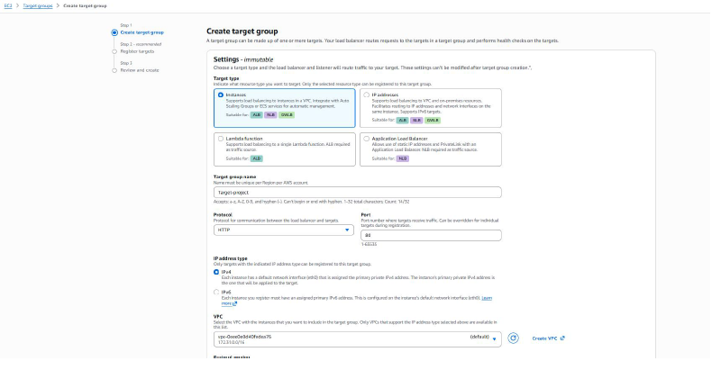
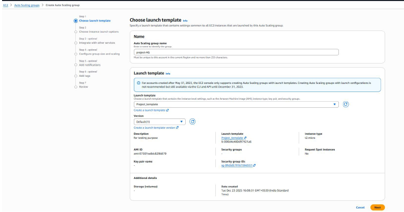
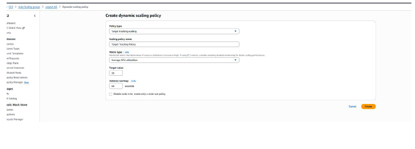
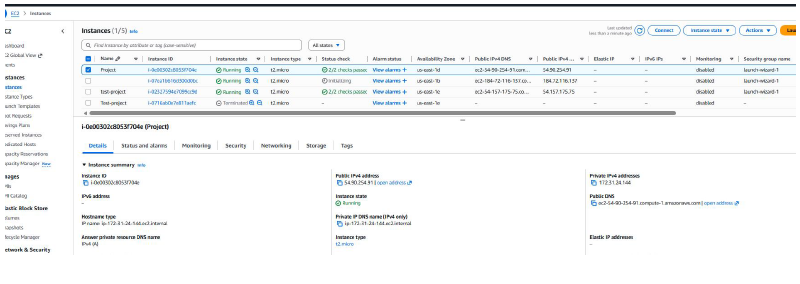
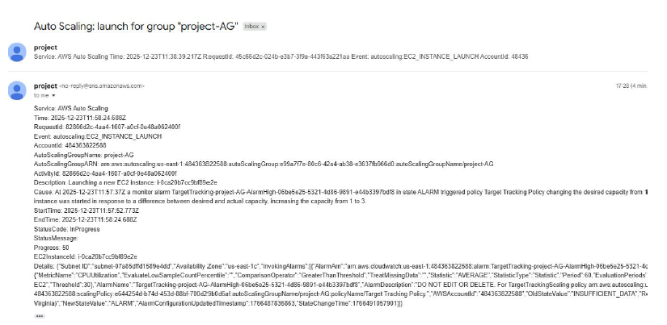

# AWS Auto Scaling, Monitoring & Notification Project

## 📌 Project Overview

This project demonstrates automatic scaling, load distribution, monitoring, and alerting using AWS services.

An EC2 instance is initially configured as the base application/server instance. After the required configuration is completed, an **Amazon Machine Image (AMI)** is created from the EC2 instance.

The AMI is then used through a **Launch Template** by an **Auto Scaling Group (ASG)** to automatically launch new EC2 instances when the configured scaling conditions are met.

An **Application Load Balancer (ALB)** distributes incoming application traffic across healthy EC2 instances managed by the Auto Scaling Group.

**Amazon CloudWatch** monitors CPU utilization and evaluates the configured alarm/scaling conditions. The **Target Tracking Scaling Policy** automatically adjusts the desired capacity of the Auto Scaling Group based on the configured CPU utilization target.

**Amazon SNS** is configured separately with CloudWatch to send email notifications when the configured alarm condition occurs.

This setup demonstrates **automatic scaling, load distribution, instance health checks, monitoring, alerting, scalability, and high availability** using AWS services.

---

# 🏗️ Architecture


### Architecture Flow

```text
                              Users
                                |
                                v
                   Application Load Balancer
                                |
                                v
                       Target Group
                                |
                 +--------------+--------------+
                 |                             |
                 v                             v
             EC2 Instance                 EC2 Instance
                 |                             |
                 +--------------+--------------+
                                |
                         Auto Scaling Group
                                ^
                                |
                         Launch Template
                                ^
                                |
                               AMI
                                ^
                                |
                       Create AMI from
                       Original EC2 Instance


                  +-------------------------+
                  |       CloudWatch         |
                  |   CPU Utilization        |
                  +------------+-------------+
                               |
                         Scaling Condition
                               |
                               v
                  +-------------------------+
                  | Target Tracking Policy   |
                  +------------+-------------+
                               |
                               v
                       Auto Scaling Group
                               |
                           Scale Out
                               |
                               v
                       New EC2 Instance


                  +-------------------------+
                  |     CloudWatch Alarm     |
                  +------------+-------------+
                               |
                               v
                              SNS
                               |
                               v
                       Email Notification
```

---

# ☁️ AWS Services Used

| AWS Service                   | Purpose                                                                      |
| ----------------------------- | ---------------------------------------------------------------------------- |
| **Default VPC**               | Provides the networking environment                                          |
| **Amazon EC2**                | Hosts the application/server                                                 |
| **Amazon AMI**                | Provides the base image used to launch EC2 instances                         |
| **Launch Template**           | Defines the configuration used by the Auto Scaling Group to launch instances |
| **Application Load Balancer** | Distributes incoming application traffic                                     |
| **Target Group**              | Registers EC2 instances and performs health checks                           |
| **Auto Scaling Group**        | Automatically manages EC2 instance capacity                                  |
| **Target Tracking Policy**    | Adjusts capacity based on the configured CPU utilization target              |
| **Amazon CloudWatch**         | Monitors CPU utilization and manages alarms                                  |
| **Amazon SNS**                | Sends email notifications                                                    |
| **IAM**                       | Provides required permissions                                                |

---

# 🔹 1. Default VPC

The project uses the **AWS Default VPC and its existing subnets** as the networking environment.

No separate custom VPC was created for this project.

The Application Load Balancer, EC2 instances, and Auto Scaling resources are deployed within the available default VPC networking environment.

### VPC Configuration


---

# 🔹 2. EC2 Instance

An EC2 instance was initially configured as the base application/server instance.

The required operating system, application, and server configuration were completed on this instance before creating the AMI.

### Configuration

* Amazon EC2
* Amazon Linux
* Instance Type: `<instance-type>`
* Security Group configured for required traffic
* Application/Web Server configured
* Instance used as the base for AMI creation

### EC2 Instance



---

# 🔹 3. Amazon Machine Image (AMI)

After configuring the original EC2 instance, an **Amazon Machine Image (AMI)** was created.

The AMI captures the required instance configuration and is used as the base image for launching additional EC2 instances.

The Auto Scaling Group uses this AMI through a Launch Template to ensure that newly launched instances have the required configuration.

### AMI Creation Flow

```text
Original EC2 Instance
        |
        | Create AMI
        v
       AMI
        |
        | Used by Launch Template
        v
 Auto Scaling Group
        |
        v
 New EC2 Instances
```

### AMI



---

# 🔹 4. Launch Template

A **Launch Template** was configured using the AMI created from the original EC2 instance.

The Launch Template defines the configuration that the Auto Scaling Group uses when launching new EC2 instances.

### Configuration

* AMI
* Instance type
* Security group
* Required instance configuration
* Launch settings used by the Auto Scaling Group

### Launch Template



---

# 🔹 5. Application Load Balancer

An **Application Load Balancer (ALB)** was configured to distribute incoming application traffic across the EC2 instances managed by the Auto Scaling Group.

The ALB forwards traffic to the Target Group, which contains the EC2 instances.

### Configuration

* Internet-facing Application Load Balancer
* Listener configured on `<port>`
* Target Group attached
* Health checks configured
* Traffic distributed across healthy EC2 instances

### Application Load Balancer



---

# 🔹 6. Target Group

A **Target Group** was configured and associated with the Application Load Balancer.

The Target Group registers EC2 instances and continuously performs health checks.

Only healthy instances are considered available to receive traffic from the Application Load Balancer.

### Target Group Flow

```text
Application Load Balancer
          |
          v
     Target Group
       /       \
      v         v
   EC2 #1     EC2 #2
   Healthy    Healthy
```

### Target Group



---

# 🔹 7. Auto Scaling Group

An **Auto Scaling Group (ASG)** was configured using the Launch Template.

The Auto Scaling Group manages the number of EC2 instances according to the configured minimum, desired, and maximum capacity.

The ASG is also associated with the Target Group so that newly launched instances can become part of the load-balanced application environment.

### Configuration

* Minimum Capacity: `<min>`
* Desired Capacity: `<desired>`
* Maximum Capacity: `<max>`
* Launch Template configured
* AMI configured through Launch Template
* Target Group attached
* Target Tracking Scaling Policy configured

### Auto Scaling Group



---

# 🔹 8. Target Tracking Scaling Policy

A **Target Tracking Scaling Policy** was configured for the Auto Scaling Group.

The policy monitors the selected CloudWatch metric and attempts to maintain the configured target value.

For this project, **EC2 CPU utilization** is used as the scaling metric.

When CPU utilization increases beyond the desired target for the configured evaluation period, the Auto Scaling Group can automatically increase capacity by launching additional EC2 instances.

### Scaling Flow

```text
EC2 CPU Utilization
        |
        v
CloudWatch Metric
        |
        v
Target Tracking Policy
        |
        v
Auto Scaling Group
        |
        v
Increase Desired Capacity
        |
        v
Launch New EC2 Instance
```

---

# 🔹 9. CloudWatch Monitoring

**Amazon CloudWatch** was configured to monitor EC2 CPU utilization.

CloudWatch collects the required metrics and evaluates the configured alarm/scaling conditions.

A CloudWatch alarm was also configured for the required notification scenario.

### Monitoring Flow

```text
EC2 Instance
      |
      v
CPU Utilization
      |
      v
CloudWatch
      |
      +----------------------+
      |                      |
      v                      v
Scaling Policy          CloudWatch Alarm
      |                      |
      v                      v
Auto Scaling                SNS
```

### CloudWatch Alarm



---

# 🔹 10. Auto Scaling Test

To test the Auto Scaling configuration, CPU load was generated on the EC2 instance.

The increased CPU utilization was detected by CloudWatch.

The Target Tracking Scaling Policy then evaluated the CPU utilization against the configured target and the Auto Scaling Group launched an additional EC2 instance when required.

### Scaling Test Flow

```text
CPU Load Generated
        |
        v
CPU Utilization Increases
        |
        v
CloudWatch Monitors Metric
        |
        v
Target Tracking Policy
        |
        v
Auto Scaling Group
        |
        v
Scale Out
        |
        v
New EC2 Instance Launched
        |
        v
Instance Registered with Target Group
        |
        v
ALB Distributes Traffic
```

### Scaling Activity



---

# 🔹 11. New Instance Registration

When the Auto Scaling Group launches a new EC2 instance, the instance is automatically registered with the associated Target Group.

The Target Group performs a health check on the new instance.

Once the instance becomes healthy, the Application Load Balancer can begin routing traffic to it.

### Instance Registration Flow

```text
Auto Scaling Group
        |
        v
Launch New EC2 Instance
        |
        v
Register with Target Group
        |
        v
Health Check
        |
        v
Healthy
        |
        v
ALB Routes Traffic
```

### Target Health


---

# 🔹 12. SNS Email Notification

**Amazon SNS** was configured to send email notifications based on the configured CloudWatch alarm.

This provides proactive notification when the monitored condition occurs.

SNS and Auto Scaling serve different purposes in this architecture:

* **Auto Scaling** handles infrastructure scaling.
* **CloudWatch** monitors metrics and evaluates alarm conditions.
* **SNS** delivers notifications when configured CloudWatch alarm events occur.

### Notification Flow

```text
CloudWatch Alarm
       |
       v
      SNS
       |
       v
Email Notification
```

### SNS Notification



---

# 🔹 13. Load Distribution

After additional EC2 instances are launched by the Auto Scaling Group and pass the Target Group health checks, the Application Load Balancer distributes incoming traffic across the available healthy instances.

```text
                     Application Load Balancer
                              |
                 +------------+------------+
                 |                         |
                 v                         v
             EC2 Instance 1           EC2 Instance 2
                 |                         |
                 +------------+------------+
                              |
                         Target Group
                              |
                         Auto Scaling
```

This provides better availability and allows the application environment to handle increased traffic or workload.

---

# 🔹 14. Project Testing

The following scenarios were tested during the implementation:

* EC2 instance configuration
* AMI creation from the original EC2 instance
* Launch Template configuration
* Auto Scaling Group configuration
* Application Load Balancer connectivity
* Target Group configuration
* Target Group health checks
* CPU utilization monitoring
* CloudWatch alarm configuration
* Target Tracking Scaling Policy
* CPU-based scale-out
* New EC2 instance launch through ASG
* New instance registration with Target Group
* Load distribution through ALB
* SNS email notification

---

# 🔹 15. Key Learnings

Through this project, I gained hands-on experience with:

* Amazon EC2
* Amazon Machine Images (AMI)
* Launch Templates
* Application Load Balancer
* Target Groups
* Health checks
* Auto Scaling Groups
* Target Tracking Scaling Policies
* CloudWatch metrics and alarms
* CPU-based scaling
* Amazon SNS
* IAM permissions
* AWS infrastructure monitoring
* Load distribution
* High availability and scalability concepts
* AWS troubleshooting

---

# 🚀 Project Outcome

Successfully implemented and tested an AWS infrastructure that provides:

* **Automatic EC2 scaling** based on CPU utilization
* **Load distribution** using Application Load Balancer
* **Instance health monitoring** using Target Groups
* **AMI-based instance provisioning**
* **Automatic instance registration**
* **CloudWatch-based monitoring**
* **SNS email alerting**
* **Scalability and improved availability** using Auto Scaling Groups

The project demonstrates practical hands-on experience with AWS compute, load balancing, auto scaling, monitoring, alerting, and infrastructure operations.

